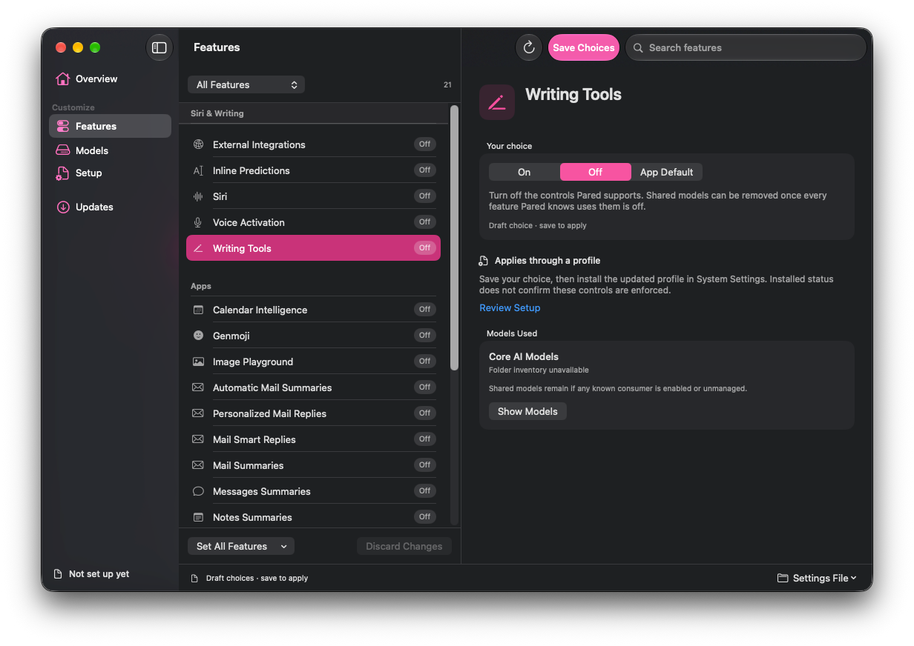
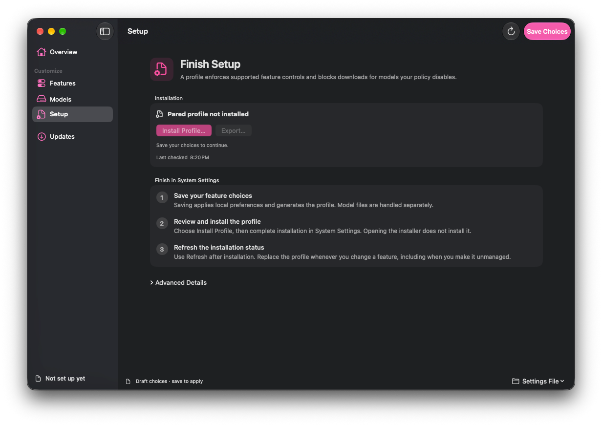

<!-- rumdl-disable MD033 MD041 -->

<p align="center">
  
</p>

<a id="install" name="install"></a>

<p align="center">
  <a href="https://github.com/4evy/pared/releases/latest/download/pared-app-macos-arm64.zip">
    
  </a>
  <br>
  Unzip the download and drag Pared to Applications.
</p>

**Prefer the guided terminal installer?** Open **Terminal** from Applications ->
Utilities, paste this command, and press Return:

```sh
curl -fsSL --proto '=https' --proto-redir '=https' \
  https://github.com/4evy/pared/releases/latest/download/install.sh | sh
```

Both downloads require an Apple silicon Mac running macOS 27 or newer and will
be available with the [first prebuilt release](https://github.com/4evy/pared/releases).
The terminal installer opens a wizard; you don’t need Xcode or Homebrew.

<p align="center">
  <a href="https://4evy.github.io/pared/">Website</a> ·
  <a href="https://4evy.github.io/pared/docs/">Documentation</a> ·
  <a href="docs/cli.md#install">More install options</a>
</p>

# Apple Intelligence, on your terms

Pared helps you choose which Apple Intelligence features stay on your Mac. Keep
Writing Tools, turn off Genmoji, or switch everything off. Then review and
remove the downloaded models you no longer need.

It’s a native Mac app with a terminal wizard and Nix modules too. System
Integrity Protection, your Mac’s built-in system protection, stays enabled.

<p align="center">
  
</p>

## Keep what you use

Choose features individually, or turn them all off at once. Pared keeps a shared
model whenever a feature in its catalog still needs it. For example, keeping
Siri also keeps its shared foundation models.

<p align="center">
  
</p>

## A few choices, then a review

1. **Choose your features.** Set each one to On, Off, or App Default. A new
   policy starts with everything off; review your choices before saving
2. **Finish setup.** Install Pared’s configuration profile in System Settings.
   It applies supported controls and blocks unwanted model downloads
3. **Review model removal.** Pared shows which models can go before you
   confirm. Saving feature settings and removing models are separate actions

<p align="center">
  
</p>

Want a feature back? Turn it on, install the updated profile, then request its
models in Pared. Downloads continue in the background. For features Pared can’t
request directly, turn them on in their Apple app.

## Build from source

To try the app before prebuilt downloads are available, install Xcode 27 or
newer and run these commands from this checkout:

```sh
tools/build-app.sh
open .build/Pared.app
```

For the CLI, installation alternatives, and offline setup, see the [command-line
guide](docs/cli.md#install).

## Use

Open the app to choose features, finish profile setup, and review model removal.
Opening Pared does not change your settings.

Prefer the terminal? Run `pared wizard` for guided setup. Use arrow keys and
Enter to move through the menus, Space to select features, and `/` to search.
Your feature changes stay in a draft until you save.

<p align="center">
  
</p>

The walkthrough previews removal and discards the draft. Read the [command-line
guide](docs/cli.md) for commands, keeping Siri, and downloading models again.

### Configure it with Nix

Pared includes nix-darwin and Home Manager modules. Keep your feature choices in
your configuration and rebuild to apply preferences and generate a profile.
Install the profile through System Settings to block future downloads.

Both modules also clean up eligible models during activation by default. You can
turn this off with `programs.pared.cleanupOnActivation = false;`.

Follow the [Nix setup guide](https://4evy.github.io/pared/docs/#quick-start) and
[option reference](https://4evy.github.io/pared/docs/#sec-options).

## How it works

Pared asks Apple’s own asset service to remove downloaded models, so System
Integrity Protection stays on. Its feature catalog connects your choices to
local settings, profile controls, and the models each feature uses.

Read [how profiles and model removal work](docs/how-it-works.md) for the
technical details and compatibility limits.
